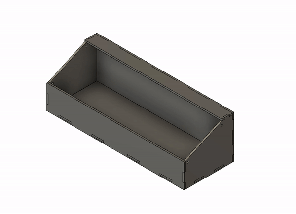
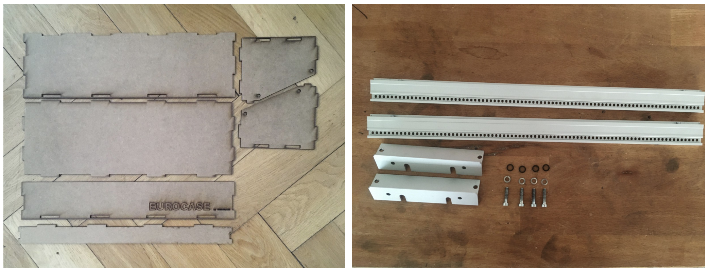
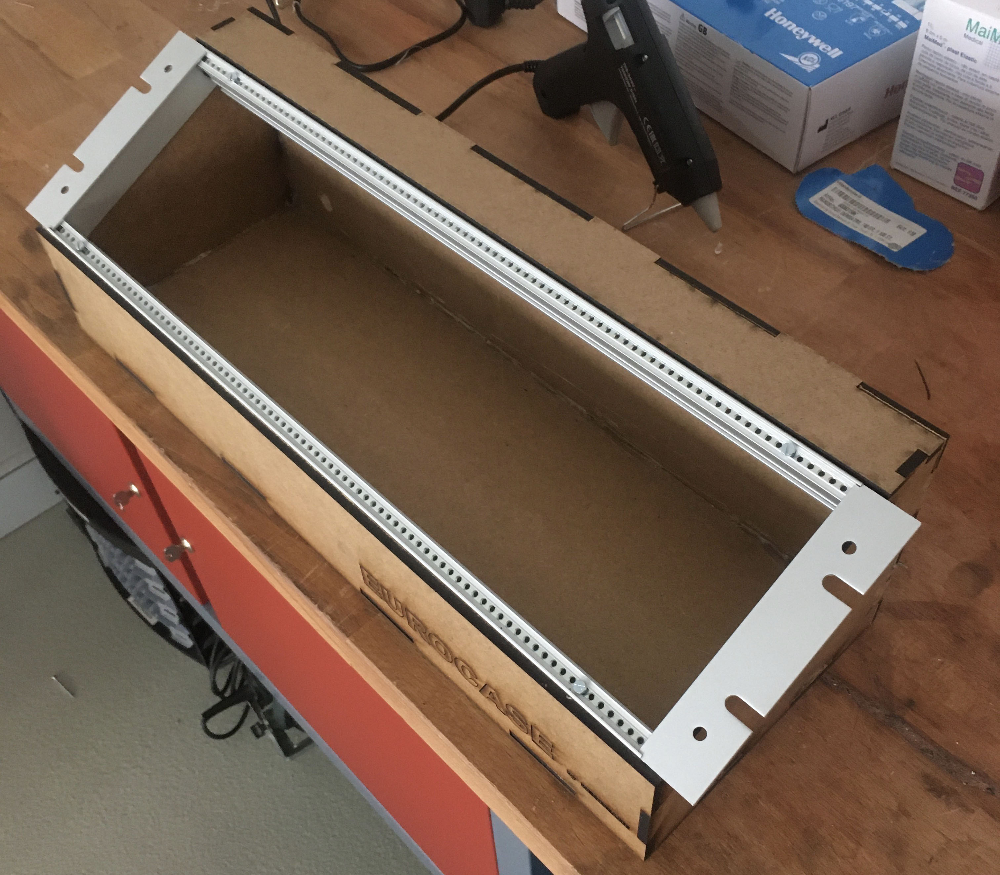
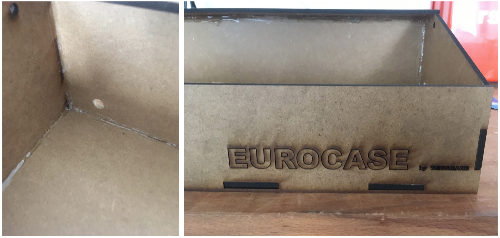
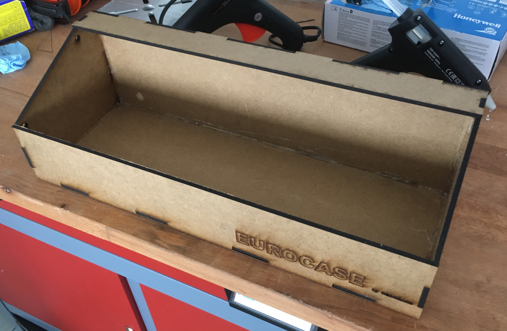
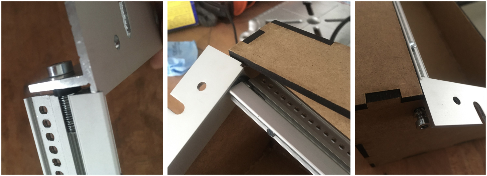
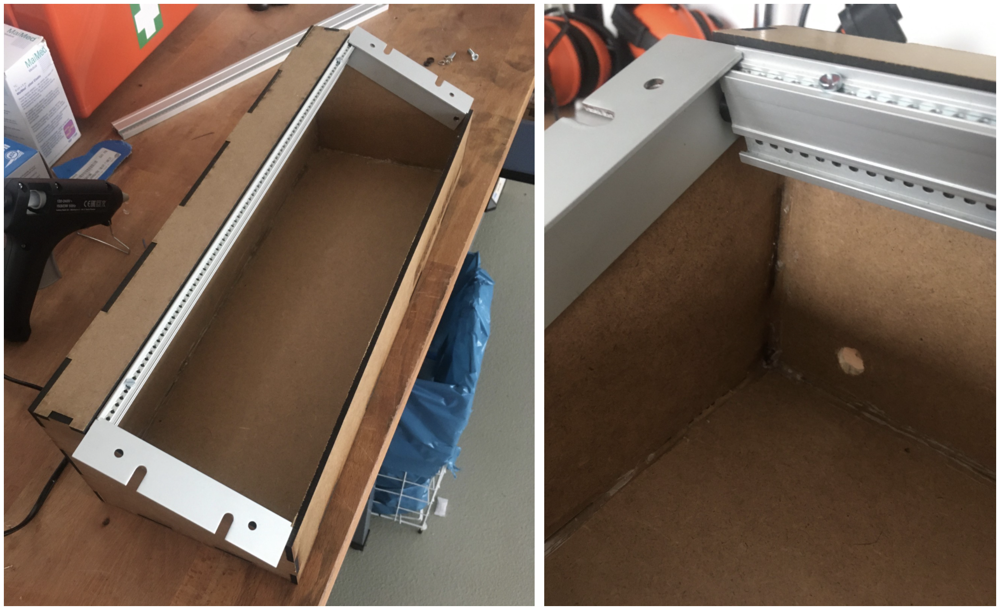
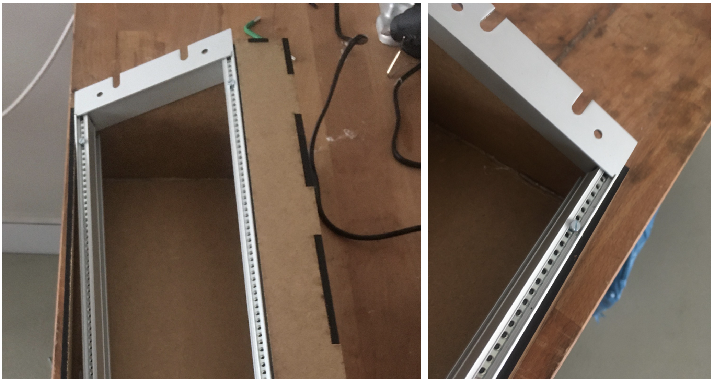

# Eurocase
DIY Eurorack / Modular synthesizer case by Wesemane Industries

## Overview

## What you will need

The left image shows all medium-density fibreboard (MDF) parts needed. You can either order them from my [Tindie shop](https://www.tindie.com/products/wesemane-industries/eurocase-by-wesemane-industries/) or laser cut them yourself (see DIY section below if you want to do so).  
The right image shows rails (including tapped strips), fixing brackets and all needed screws. You can get these parts from Schneidersladen following these links (Screws are included): 
* 2x [SB Rail 19"](https://schneidersladen.de/de/sb-rail-19-mit-kante) 
* 2x [Tapped strips 84TE (Gewindestreifen)](https://schneidersladen.de/de/gewindestreifen-84te)  
* 2x [Fixing bracket for 19"(Haltewinkel f. 19" BGT 3 HE)](https://schneidersladen.de/de/haltewinkel-f.-19-bgt-3-he)

## What it will look like in the end

## How to build
### Step 1 
Get all parts described above

### Step 2
Get a hot glue gun and hot glue all parts. I think it is self explanatory how to do that.  

You should end up with a case that looks like this

### Step 3
The 19" SB rails will be delivered including screws, but there will be no thread to hold the screws. You can use the screws to create the correct thread by just screwing them in. But make sure when you start to hold the screw perpendicular to the rail otherwise you will have issues later. The end result should look like this

### Step 4
This step shows how to the fixing bracket is attached to the rail. The left image shows how you could optionally add a washer for stability, but it is not necessarily needed. Start by attaching the fixing bracket to the top left corner by using the designated drill hole in the case. Do not screw it in all the way just yet otherwise you could break it. Wait to finally fix it in the next Step.

### Step 5
Next attach it to the opposite side and screw both sides in tightly.

### Step 6
Do the same thing for the bottom row.

### Step 7
You are done! Your case should look like expected in the image above. Congrats enjoy your new Eurocase!

## DIY
You want to laser cut the case yourself? Navigate to [DIY](./DIY) folder and do it! You will find all files as *.dxf* and a fully prepared Illustrator *.ai* file.
